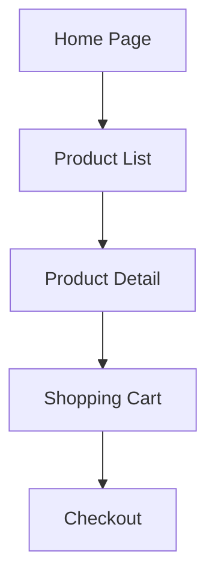

# Repository Documentation Agent

The Repository Documentation Agent is a specialized agent that analyzes a repository and generates comprehensive documentation in markdown format. It provides detailed insights into the repository structure, components, pages, and interactions.

## Features

- **Repository Structure Analysis**: Analyzes the repository file system and categorizes files based on patterns and naming conventions.
- **Component Analysis**: Identifies reusable components, their properties, dependencies, and usage patterns.
- **Page Analysis**: Analyzes pages, their navigation flows, URL parameters, and routing logic.
- **Interaction Analysis**: Analyzes click handlers and interaction flows in pages and components.
- **Documentation Generation**: Generates comprehensive markdown documentation with diagrams based on the analysis results.

## Installation

```bash
pip install autogen-ext
```

## Usage

```python
import asyncio
from autogen_agentchat.ui import Console
from autogen_ext.agents.repo_doc import RepoDocAgent
from autogen_ext.models.openai import OpenAIChatCompletionClient

async def main():
    # Create the model client
    model_client = OpenAIChatCompletionClient(model="gpt-4")
    
    # Create the repository documentation agent
    agent = RepoDocAgent(
        name="repo_doc_agent",
        model_client=model_client,
        repo_path="/path/to/repository",
    )
    
    # Run the agent to generate documentation
    await Console(
        agent.run_stream(
            task="Generate comprehensive documentation for the repository"
        )
    )

if __name__ == "__main__":
    asyncio.run(main())
```

## Documentation Format

The generated documentation includes:

1. **Repository Overview**: Purpose and general information about the repository.
2. **Repository Structure Analysis**:
   - Total number of files, directories, pages, components, and utilities
   - Directory structure
   - List of pages/views
   - List of reusable components
   - List of shared utility classes

3. **Component Documentation**:
   - Component categories
   - Detailed component properties, dependencies, and usage

4. **Page-by-Page Analysis**:
   - Page navigation flowcharts
   - Page URL parameters and routing logic
   - UI component breakdown
   - Click handlers and interaction flows

## Component Detection Rules

The agent uses the following rules to detect and categorize files:

### Pages/Views Detection Rules
- Files in directories named "pages", "views", "screens", "routes"
- Files that import routing libraries
- Files that define page-level components
- Files with naming patterns like "Page", "View", "Screen" suffixes

### Component Detection Rules
- Files in directories named "components", "ui", "elements"
- Files that export a single component
- Files with naming patterns like "Button", "Card", "Modal" prefixes
- Components that are imported by multiple pages

### Utility Detection Rules
- Files in directories named "utils", "helpers", "lib", "common"
- Files containing primarily function definitions rather than components
- Files with naming patterns like "utils", "helpers", "services"

## UI Flow Representation

The agent uses Mermaid.js flowcharts to represent UI flows in the markdown documentation:

```markdown

```

## Click Handler Analysis

The agent analyzes click handlers and interaction flows by:

- Identifying event handlers in component code (onClick, onSubmit, etc.)
- Tracing the handler functions to understand their behavior
- Documenting the data flow and state changes triggered by interactions
- Mapping interactions to navigation events or UI state changes

## Example

See the `examples/repo_doc_example.py` file for a complete example of how to use the Repository Documentation Agent.

## License

This project is licensed under the MIT License - see the LICENSE file for details.
